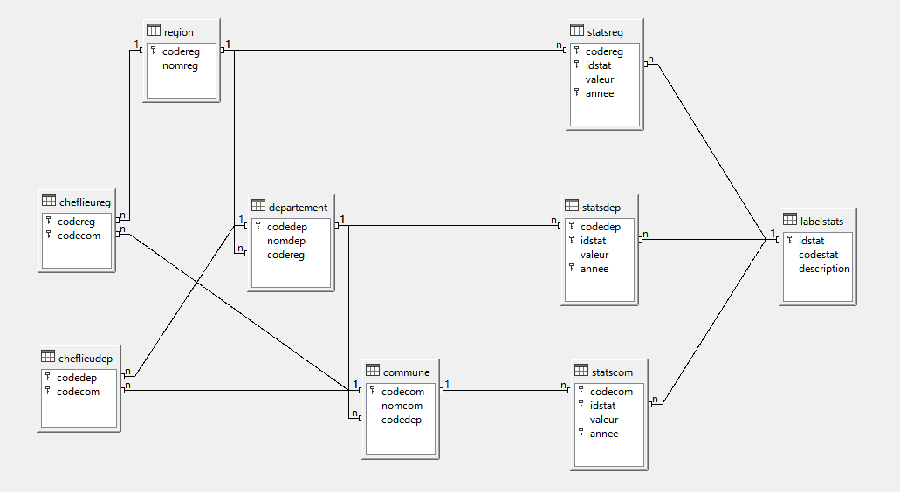

# Bases de Données Avancées
*Théophile Baranger & Erwan Leroux*

Ce dépôt contient le code source pour la création et l'administration d'une base de données SQL sous PostgreSQL en Python avec psycopg2, dans le cadre d'un projet du cours de Bases de Données Avancées en Master 1 à l'Université de Bordeaux, assuré par Bruno Pinaud en 2020/2021. 

## Introduction
L'objectif de ce projet était d'apprendre à manipuler une base de données dans un langage de plus haut niveau, ici Python, et d'illustrer certaines des propriétés liées aux requêtes telle que l'optimisation du temps de calcul grâce à l'utilisation d'index, la création de vue, l'utilisation de triggers, etc. La modélisation de la base de données ainsi que la création des fichiers d'import de données ont aussi représenté une part importante du travail total. 

### Données
Les données qu'il nous était proposé d'utiliser pour ce projet sont les données de l'INSEE concernant les communes, départements, et régions françaises. En particulier, nous avons utilisé les fichiers "séries historiques" concernant les communes, contenant de nombreuses statistiques dont la population des communes de France pour les années 1968, 1975, 1982, 1990, 1999, 2007, 2012 et 2017 (<a href="https://www.insee.fr/fr/statistiques/4515941">Séries historiques en 2017 | Insee</a>). L'intérêt de ces données est que le découpage géographique utilisé est le plus récent, et on évite ainsi toutes les questions liées au fusionnement des communes.

Concernant les données liées aux départements et aux régions, il s'agit des statistiques intitulées <a href="https://www.insee.fr/fr/statistiques/2512993">Développement durable&nbsp;: 20 indicateurs régionaux et départementaux</a> (source : Insee), qui regroupent des indicateurs économiques (e.g. taux de chômage), sociaux, environnementaux, et autres.

### Modèle relationnel
Voici une illustration avec LibreOffice Base du modèle relationnel que nous avons finalement utilisé pour représenter ces données.


## Contenu
Les fichiers "tables.sql" et "stats.sql" permettent de créer les tables et d'insérer les méta-données concernant les statistiques. Ensuite, l'import des données provenant des fichiers CSV se fait directement à partir des scripts Python se trouvant dans le fichier 'src'. La connexion/déconnexion à la base de données est effectuée grâce aux fichiers 'connexion.py' et 'deconnexion.py', que l'on importe ensuite dans tous les autres fichiers d'exécutions de requêtes. 

## Création de la base
Pour créer et importer les données dans la base, il est nécessaire de tout d'abord exécuter les fichiers "tables.sql" et "stats.sql". Ensuite, choisir l'une de deux méthodes pour importer les données. Soit exécuter les fichiers suivants dans l'ordre, ce qui permet de vérifier l'import instantanément par des requêtes intégrées aux scripts.

* import_reg.py
* import_dep.py
* import_com.py
* import_cheflieureg.py
* import_cheflieudep.py
* import_statsreg.py
* import_statsdep.py
* import_pop.py
* import_superf.py

On peut également importer toutes les données à la fois en lançant le script suivant :

* import.py

Mais alors aucune requête de vérification n'est lancée. Il faut alors s'assurer que les données ont bien été importées.

### Travail

Les fichiers commençant par "questionX" contiennent des scripts permettant de répondre aux questions posées dans le sujet. Par exemple, le fichier "question1_requetes.py" permet d'interroger la base en sélectionnant une région, puis un département, et finalement d'afficher diverses statistiques sur ce département.

#### Requêtes

*Fichier 'question1_requetes.py'*

Nous avons choisi d’illustrer l’instanciation de notre base de données en construisant un script qui permet à l’utilisateur de récolter diverses statistiques sur le département de son choix. Ainsi, en lançant le script ‘question1_requetes.py’, l’utilisateur est invité tout d’abord à choisir une région, puis un département, et enfin la liste de statistiques concernant ce département est fournie. Certaines de ces statistiques sont stockées dans la base, et d’autres telle que la population, sont calculées à la volée.

##### Choix de la région

En exécutant le script ‘question1_requetes.py’, l’utilisateur est invité via ligne de commande à choisir une région, en entrant le code correspondant.

```
Liste des régions de France :
Code 01 : Guadeloupe
Code 02 : Martinique
Code 03 : Guyane
Code 04 : La Réunion
Code 06 : Mayotte
Code 11 : Île-de-France
Code 24 : Centre-Val de Loire
Code 27 : Bourgogne-Franche-Comté
Code 28 : Normandie
Code 32 : Hauts-de-France
Code 44 : Grand Est
Code 52 : Pays de la Loire
Code 53 : Bretagne
Code 75 : Nouvelle-Aquitaine
Code 76 : Occitanie
Code 84 : Auvergne-Rhône-Alpes
Code 93 : Provence-Alpes-Côte d'Azur
Code 94 : Corse

Entrez le code de la région souhaitée : 
```
Si un code incorrect est entré trois fois, alors la connexion à la base de données est interrompue et le programme se termine.

##### Choix du département

Supposons que l’utilisateur ait choisi le code région ‘75’ pour la Nouvelle-Aquitaine. Alors il est alors invité à choisir un département.

```
Liste des départements de Nouvelle-Aquitaine :
Code 16 : Charente
Code 17 : Charente-Maritime
Code 19 : Corrèze
Code 23 : Creuse
Code 24 : Dordogne
Code 33 : Gironde
Code 40 : Landes
Code 47 : Lot-et-Garonne
Code 64 : Pyrénées-Atlantiques
Code 79 : Deux-Sèvres
Code 86 : Vienne
Code 87 : Haute-Vienne

Entrez le code du département souhaité :
```

##### Statistiques du département

Supposons pour illustrer les requêtes, que le département choisi soit le département ‘33’, la Gironde. Le programme retourne alors la liste de statistiques suivantes :

```
Vous avez choisi le département 33 : Gironde

Voici quelques statistiques concernant le département Gironde :

- Chef-lieu : Bordeaux
- Superficie : 9978km²
- Population totale en 2017 : 1583384 habitants
- Commune la plus peuplée en 2017 : Bordeaux (254436 habitants)
- Commune la moins peuplée en 2017 : Bossugan (39 habitants)

Liste des indicateurs départementaux pour le département : Gironde

Taux d'emploi (%) en 2009 : 63.6
Part des travailleurs qui se rendent au travail en voiture (%) en 2009 : 76.0
Part des travailleurs qui se rendent au travail en transport en commun (%) en 2009 : 9.7
Part des travailleurs qui se rendent au travail par un autre moyen (%) en 2009 : 14.3
Espérance de vie des hommes à la naissance (années) en 2010 : 78.5
Espérance de vie des femmes à la naissance (années) en 2010 : 85.0
Taux d'emploi (%) en 2014 : 63.5
Part des travailleurs qui se rendent au travail en voiture (%) en 2014 : 75.0
Part des travailleurs qui se rendent au travail en transport en commun (%) en 2014 : 11.1
Part des travailleurs qui se rendent au travail par un autre moyen (%) en 2014 : 13.9
Espérance de vie des hommes à la naissance (années) en 2015 : 79.6
Espérance de vie des femmes à la naissance (années) en 2015 : 85.5
```
La liste des indicateurs est stockée dans la base directement, tandis que les premières statistiques sont calculées à la volée.

#### Vues

*Fichier 'question2_vues.py'*

#### Triggers

*Fichier 'question3_triggers.py'*

#### Plans d’exécutions

*Fichier 'question6_explain.py'*

##### Analyse des plans d’exécution

On s’intéresse dans cette question à la manière dont les requêtes sont planifiées par PostgreSQL. Pour plus de détails techniques, on se réfère à la <a href=”https://www.postgresql.org/docs/11/using-explain.html” >documentation postgresql</a>. Commençons par une requête très simple.
```
EXPLAIN SELECT * FROM commune;

			     QUERY PLAN 
-----------------------------------------------------------------------------------------
Seq Scan on commune  (cost=0.00..811.51 rows=34951 width=22)

```

Il n'y a pas de clause <code>WHERE</code>, donc PostgreSQL scanne les lignes de la table une par une à l’aide d’un plan séquentiel, d’où le <code>Seq Scan</code>. On voit que pour une telle requête, l’intégralité des 34951 entrées seront retournées, ce qui est parfaitement logique.  

Regardons ce qu’il se passe lorsqu’on effectue un filtre, avec l’ajout d’une clause <code>WHERE</code>. Par exemple, si l’on souhaite récupérer les communes de Gironde.
```
EXPLAIN SELECT * FROM commune WHERE codedep = ‘33’;

			    QUERY PLAN 
--------------------------------------------------------------------------------------
Seq Scan on commune  (cost=0.00..898.89 rows=522 width=22)
Filter: ((codedep)::text = '33'::text)
```
Cette fois-ci, seulement 522 lignes sont retournées à l’exécution de cette requête, ce qui correspond à une estimation du nombre de communes de la Gironde (535). En revanche, le coût le augmente un peu car on scanne le même nombre de lignes mais on fait pour chacune la comparaison de leur <code>codedep</code>.

Voyons voir maintenant ce qu’il se passe si l’on va chercher les communes de Gironde en passant par le <code>nomdep</code> de la table <code>departement</code>, c’est-à-dire en effectuant une jointure.

```
EXPLAIN SELECT codecom, nomcom, commune.codedep 
	FROM commune, departement 
	WHERE commune.codedep = departement.codedep 
	AND nomdep = 'Gironde';

		     		QUERY PLAN 
----------------------------------------------------------------------------------------------
Hash Join  (cost=2.28..909.38 rows=346 width=22)
  Hash Cond: ((commune.codedep)::text = (departement.codedep)::text)
  ->  Seq Scan on commune  (cost=0.00..811.51 rows=34951 width=22)
  ->  Hash  (cost=2.26..2.26 rows=1 width=3)
        ->  Seq Scan on departement  (cost=0.00..2.26 rows=1 width=3)
              Filter: ((nomdep)::text = 'Gironde'::text)

```
Ici PostgreSQL a choisi d’utiliser un <code>hash join</code>. Par cette méthode, une première table est stockée en mémoire dans une table de hachage. Puis, l’autre table est scannée à son tour. Enfin, on récupère dans la table de hachage les lignes qui coïncident. Par ailleurs, l’indentation témoigne du plan d’exécution. Le scan séquentiel de <code>departement</code> permet de construire la table de hachage. Puis cette dernière lit les lignes de l’autre scan avant de chercher les correspondances. On peut remarquer que cette fois-ci <code>rows</code> vaut 346. On a donc une moins bonne estimation qu’avec la requête précédente. Le coût augmente légèrement.  

Finalement, si l’on veut récupérer ces communes en utilisant la clé primaire de <code>commune</code>, c’est-à-dire <code>codecom</code>, on obtient :

```
EXPLAIN SELECT * FROM commune 
WHERE codecom BETWEEN '33000' AND '33999';

					QUERY PLAN 
--------------------------------------------------------------------------------------------------------------------
Index Scan using cle_commune on commune  (cost=0.29..8.59 rows=15 width=22)
  Index Cond: (((codecom)::text >= '33000'::text) AND ((codecom)::text <= '33999'::text))
```

En effectuant la sélection sur la clé primaire (qui fonctionne alors comme un index), on remarque que le coût estimé est bien inférieure aux méthodes précédentes. En revanche, le nombre de lignes estimées est loin de la vérité.

##### Comparaison des temps d’exécution

Pour conclure, on s’intéresse aux temps d’exécution de ces requêtes dans la pratique, afin de vérifier les analyses théoriques effectuées par PostgreSQL. On utilise donc la commande ANALYZE, qui permet en plus de EXPLAIN d’exécuter les requêtes. On obtient alors les résultats suivants.

###### Requête 1
```
EXPLAIN ANALYZE SELECT * FROM commune;
Seq Scan on commune  (cost=0.00..811.51 rows=34951 width=22) (actual time=0.290..2.079 rows=34951 loops=1)
Planning Time: 0.013 ms
Execution Time: 2.942 ms
```

###### Requête 2
```
EXPLAIN ANALYZE SELECT * FROM commune WHERE codedep = '33';
Seq Scan on commune  (cost=0.00..898.89 rows=522 width=22) (actual time=1.013..2.564 rows=535 loops=1)
(...)
Planning Time: 0.022 ms
Execution Time: 2.583 ms
```

###### Requête 3
```
EXPLAIN ANALYZE SELECT codecom, nomcom, commune.codedep 
	FROM commune, departement 
	WHERE commune.codedep = departement.codedep 
	AND nomdep = 'Gironde';

Hash Join  (cost=2.28..909.38 rows=346 width=22) (actual time=1.644..4.535 rows=535 loops=1)
(...)
Planning Time: 0.105 ms
Execution Time: 4.559 ms
```

###### Requête 4
```
EXPLAIN ANALYZE SELECT * 
	FROM commune 
	WHERE codecom BETWEEN '33000' AND '33999';

Index Scan using cle_commune on commune  (cost=0.29..8.59 rows=15 width=22) (actual time=0.031..0.146 rows=535 loops=1)
  Index Cond: (((codecom)::text >= '33000'::text) AND ((codecom)::text <= '33999'::text))
Planning Time: 0.036 ms
Execution Time: 0.165 ms
```

On peut les représenter de façon plus concise dans le tableau suivant :

| Requête       | Temps d’exécution (ms) | 
| --------------|:----------------------:| 
| Requête 1     |         2.942          | 
| Requête 2     |         2.583          | 
| Requête 3     |         4.559          | 
| Requête 4     |         0.165          |

On remarque que la requête la qui prend le moins de temps à exécuter est celle où l’on utilise un index. En effet, on avait vu que son coût théorique était bien inférieur à celui des autres requêtes. Cela se confirme avec le temps d’exécution qui est environ 20 fois inférieur à celui des autres. Enfin, on note également que le temps d’exécution de la jointure est plus long. 

